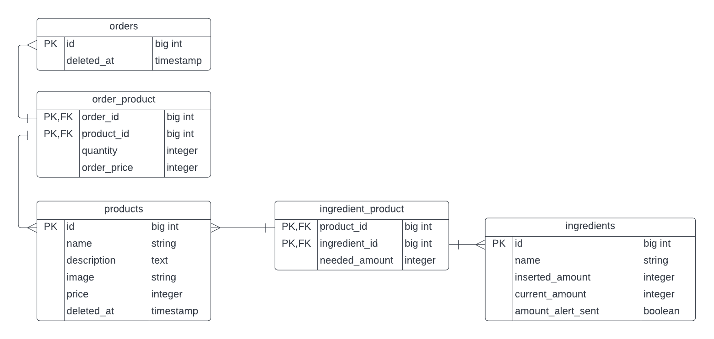

# Foodics Assignment Database Design

This file is documenting some cases related to the database design. The document won't document every single requirement. But it will focus on some important things that the developers should keep in mind while implementing the system.

## Diagram

## Database Main Tables

The database has three main tables:

* products
* ingredients
* orders

## Products and Ingredients Relationship

The product may have many ingredients. But in general an ingredient may be used in many products. Because of that we choose to use Many to many relation between the product and ingredients. And to keep track of the changes in amount in the ingredients table. We added the needed amount of the ingredient to make one unit of the product in the pivot table in `needed amount` column.

## Orders and Products Relationship

The relation between orders and products is Many to many relation. We assumed that the product will have a price. Using the `unit_price` column on the pivot table. We can know the price of the product when the user created the order. That is important to keep the order's data correct if the prices changed later.

## Prices and Amounts

All prices and amounts in the database are defined as `integer`. So, We are using Cent instead of Dollar as a price unit and Gram instead of Kilo Gram as an amount unit. We need to follow this approach to avoid having floating points. Arithmetic operations on float numbers may be inaccurate.

## Stock Notification Related Data

We need to notify the merchant when the ingredient stock level reaches 50% or below. In order to do that, We need to store the initial amount inserted to the stock in `inserted_amount` column. When a product ordered, We will update the `current_amount`. We also need a flag to check if the alert sent to the merchant to avoid sending the same alert for the same ingredient twice. More details will be discussed in the **Processes** section.

## Soft Deletes

`products` and `orders` records should be never deleted from the database as they may affect financial reports.